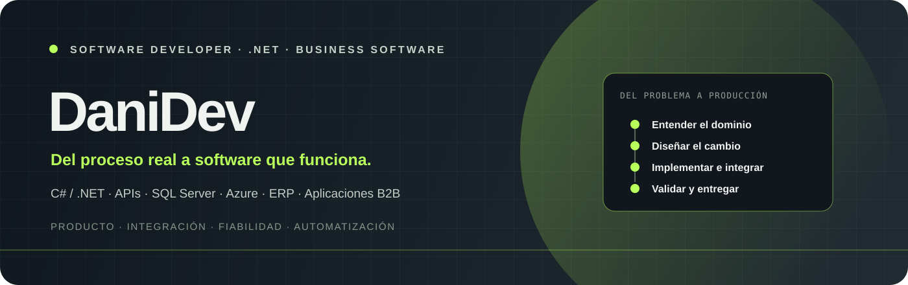
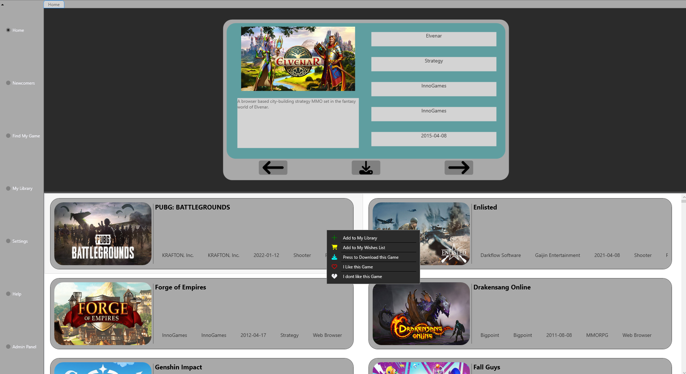
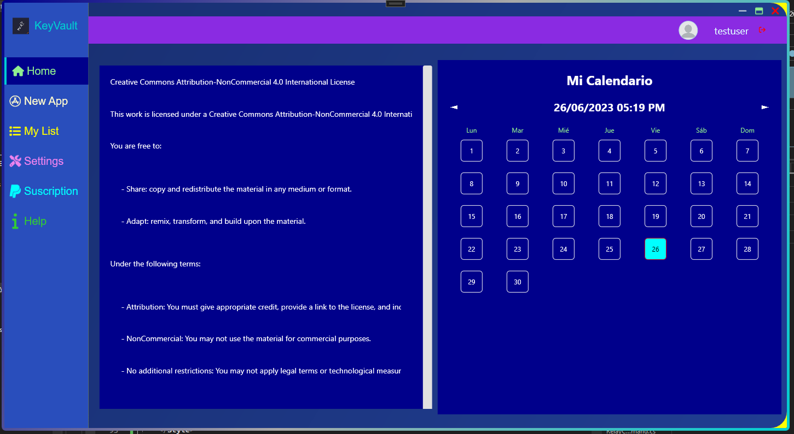
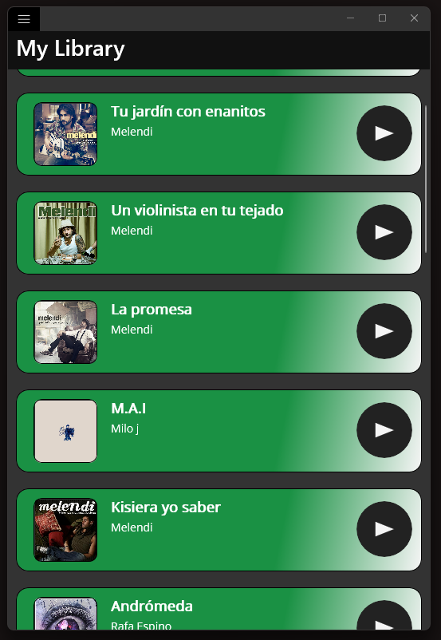

 

<a href="https://danidevsdbk.github.io/Portfolio.v2/"><strong>EXPLORAR PORTFOLIO ↗</strong></a>
&nbsp;&nbsp;·&nbsp;&nbsp;
<a href="mailto:danidevsdbk@gmail.com"><strong>CONTACTAR ↗</strong></a>
&nbsp;&nbsp;·&nbsp;&nbsp;
<a href="https://github.com/DaniDevSDBK"><strong>GITHUB ↗</strong></a>

  

 

> **Software de negocio, integraciones y automatización que resuelven problemas reales.** 
> Software Developer con experiencia profesional desde 2023 en C#/.NET, VB.NET, SQL Server, APIs, Azure, ERP en producción y aplicaciones B2B independientes.

---

## Índice

[Perfil](#perfil) · [Experiencia](#experiencia) · [Proyectos](#proyectos-destacados) · [Stack](#stack) · [Portfolio local](#ejecutar-el-portfolio-en-local) · [Estructura](#estructura-del-repositorio) · [Contacto](#contacto)

## Perfil

Trabajo de extremo a extremo: entender el proceso y sus restricciones, diseñar el cambio, implementarlo, validarlo y acompañarlo hasta su entrega. Mi experiencia abarca desarrollo y mantenimiento de producto ERP en producción, aplicaciones B2B independientes, APIs e integración de sistemas, además de soporte a usuarios y clientes.

Me interesa especialmente el software donde el criterio de ingeniería importa en el día a día: compatibilidad con flujos existentes, integridad de datos, fiabilidad, seguridad y mantenibilidad. He trabajado en problemas de concurrencia y condiciones de carrera, integración de borrado lógico, revisión de código, pruebas de integración, CI y automatización de ingeniería con IA.

<strong>Áreas de trabajo</strong>

 

| Área | Experiencia |
|:--|:--|
| Desarrollo de producto | Funcionalidades .NET de principio a fin: reglas de negocio, APIs, persistencia, interfaz y release |
| Integración | APIs, intercambio de datos y flujos conectados con sistemas empresariales |
| Aplicaciones B2B | Herramientas independientes, incluido un importador genérico de Excel configurable con plantillas |
| Fiabilidad | Concurrencia, condiciones de carrera, persistencia y efectos transversales de soft delete |
| Operación | Investigación de incidencias, soporte a usuarios y seguimiento hasta una solución mantenible |
| Ingeniería | Revisión de PR, CI, pruebas de integración, automatización y asistencia con agentes de IA |

## Proyectos destacados

<table>
  <tr>
    <td width="33%" valign="top">
      
      <h3><a href="https://github.com/DaniDevSDBK/ProjectDI_WPF">ProjectDI_WPF ↗</a></h3>
      
Aplicación de escritorio para organizar una biblioteca de videojuegos y explorar recomendaciones según preferencias.

      <strong>C#</strong> · WPF · .NET
    </td>
    <td width="33%" valign="top">
      
      <h3><a href="https://github.com/DaniDevSDBK/PManager">PManager ↗</a></h3>
      
Gestor de credenciales de escritorio con arquitectura MVVM, generador de contraseñas y almacenamiento con RSA.

      WPF · MVVM · RSA
    </td>
    <td width="33%" valign="top">
      
      <h3><a href="https://github.com/DaniDevSDBK/Statsfy">Statsfy ↗</a></h3>
      
Proyecto experimental .NET MAUI que explora autenticación OAuth 2.0 e integración con una API externa.

      C# · .NET MAUI · OAuth 2.0 · API
    </td>
  </tr>
</table>

Abre cualquier captura o título para ir directamente al repositorio del proyecto.

## Stack

<table>
  <tr><td><strong>Aplicaciones</strong></td><td>C# · VB.NET · .NET · WinForms · WPF · .NET MAUI</td></tr>
  <tr><td><strong>Datos e integración</strong></td><td>SQL Server · T-SQL · APIs · OAuth 2.0 · mapeo e importación de datos</td></tr>
  <tr><td><strong>Cloud y entrega</strong></td><td>Microsoft Azure · Git · revisión de código · CI · pruebas de integración</td></tr>
  <tr><td><strong>Calidad de producto</strong></td><td>Soporte de producción · concurrencia · seguridad · persistencia · automatización de ingeniería</td></tr>
</table>

## Portfolio web

El sitio estático presenta perfil, experiencia, casos anonimizados, stack, proyectos y contacto. Está construido con HTML, CSS y JavaScript, sin instalación de dependencias.

### Ejecutar el portfolio en local

Desde la raíz del repositorio:

<pre><code>python -m http.server 8000 --directory web</code></pre>

Abre <a href="http://localhost:8000">http://localhost:8000</a>. También puedes abrir <code>web/index.html</code> directamente.

### Publicación

El workflow de GitHub Actions en <code>.github/workflows/pages.yml</code> publica <strong>únicamente web/</strong> en GitHub Pages cuando hay cambios en <code>main</code> (o al ejecutarlo manualmente). La URL pública prevista es <a href="https://danidevsdbk.github.io/Portfolio.v2/">danidevsdbk.github.io/Portfolio.v2</a>; requiere que GitHub Pages esté habilitado para el repositorio.

## Estructura del repositorio

<pre><code>.github/workflows/pages.yml   Despliegue de la web en GitHub Pages
web/
├── index.html                Página del portfolio
├── style.css                 Sistema visual y responsive
├── script.js                 Interacciones del sitio
├── portfolio.md              Perfil profesional legible por personas y agentes
├── llms.txt                  Índice de recursos del portfolio
└── assets/                   Capturas de proyectos e ilustración de este README
</code></pre>

## Contacto

¿Tu equipo necesita desarrollar software, automatizar procesos, integrar sistemas o mejorar un producto existente?

### Hablemos de lo que necesitas construir.

<a href="mailto:danidevsdbk@gmail.com"><strong>danidevsdbk@gmail.com ↗</strong></a>

<a href="https://danidevsdbk.github.io/Portfolio.v2/">Portfolio</a> · <a href="https://github.com/DaniDevSDBK">GitHub</a>

---

Diseñado y desarrollado por <strong>DaniDev</strong> · © 2026

